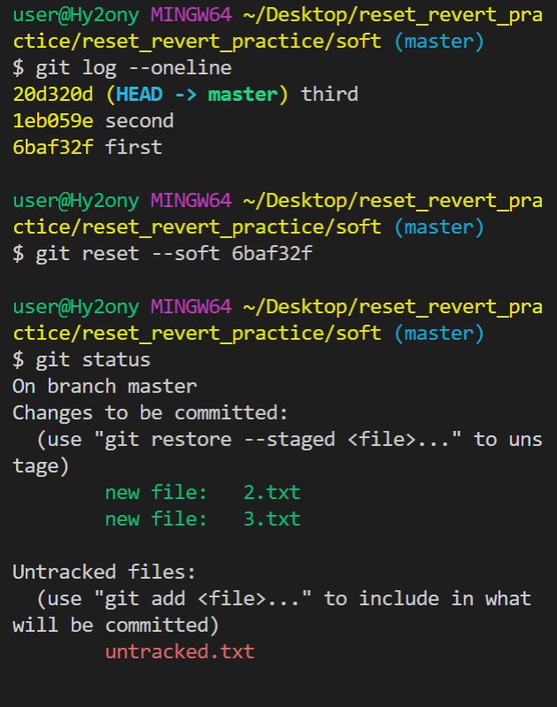
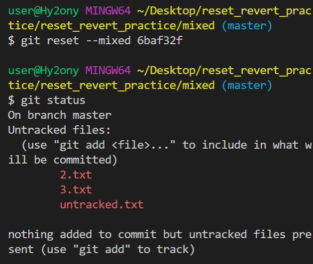
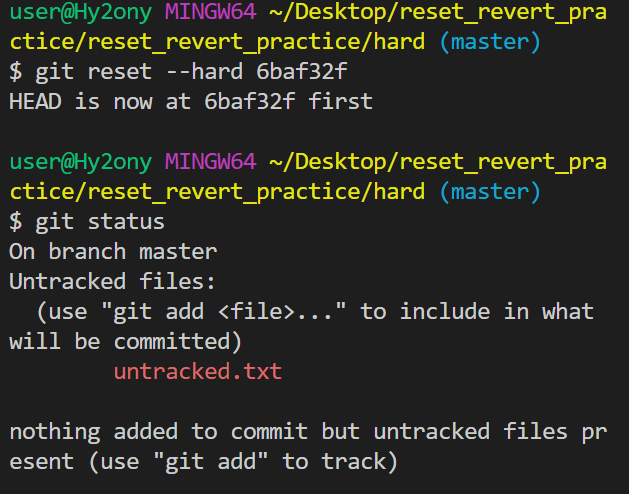

#### Undoing

- `git restore test.md` : modified 상태의 파일을 수정 전으로 되돌리기 

- `rm -rf .git` : 깃 없애기

- `git rm --cached test.md` : 버전 관리에서 파일을 빼고 싶을 때 

- unstage할 수 있는 상황:

  1. 커밋이 없을 때 : `git rm --cached test.md`

  2. 커밋이 있을 때 : `git resotre --staged test.md`

- 실수로 staging area 에 올려버렸을 때 쓰는 것! 

- `git commit --amend`: commit 자체를 재정의하는 과정(hash값 바뀜)

  1. vim에서 i 누르기 

  2. esc 

  3. :wq(write quit)

- foo & bar 할 때 foo만 commit한 상태일 때 bar도 같은 commit에 끼워넣고 싶으면 git add bar.txt 하고 `git commit --amend `
- git log 나가는법 wq
- [옵션] : -- 이 붙는것 ex) --cached, --amend 

#### git reset & revert 

- `--soft`: 과거는 돌아가지만 이후에 작업했던 파일들은 staging area에 돌려놓음(add는 되어있는 상태로)

- `--mixed`: working directory에 돌려놓음(add 하기 전 상태)

- `--hard`: working directory에서 조차 삭제, 단, untracked파일은 untracked상태로 남김 

- cd soft/ : soft 폴더로 이동
- 돌아가려면 해쉬값을 알아야함
- git reflog
- reset은 커밋 내역이 사라진다는 단점이 존재 
- revert: 없었다면 이상태였겠다 이런 느낌? 히스토리가 유지됨
- 협업 할 때에는 revert 를!! 

### Workflow

- 개발은 각각의 브랜치에서 진행 
- git push origin master : 마스터라는 branch를 푸쉬했던것 
- 만약 내가 feature/login에서 작업했다면 
- git push origin feature/login 과 같이 작성 
- 팀장을 제외한 조원은 master branch로 스위치하고 master branch를 pull 받는다
- -> 나머지 브랜치 지우기 
- 팀장은 merge를 했다면 master가 업데이트되었으니 조원들에게 pull받으라고 알려줘야함 
- 지금 내가 개발한 브랜치를 푸쉬하는 것!! 
- fork: 원본을 내 저장소에 찍어온다(복사한다)
- push는 복제한 곳으로! 원본에 push 권한은 없음 
- 복제본에 push해서 원본에 pull request를 보내야함!
- 원본: upstream, 복제: origin이면 이제 git pull upstream master 를 해야함! 
- git remote add upstream [원본저장소의 주소]
- git remote -v 

1. 우리 저장소로 fork
2. fork 한 것을 clone 
3. branch 만들고 개발하고 fork 한 곳으로 push
4. pull request만들고 보내기