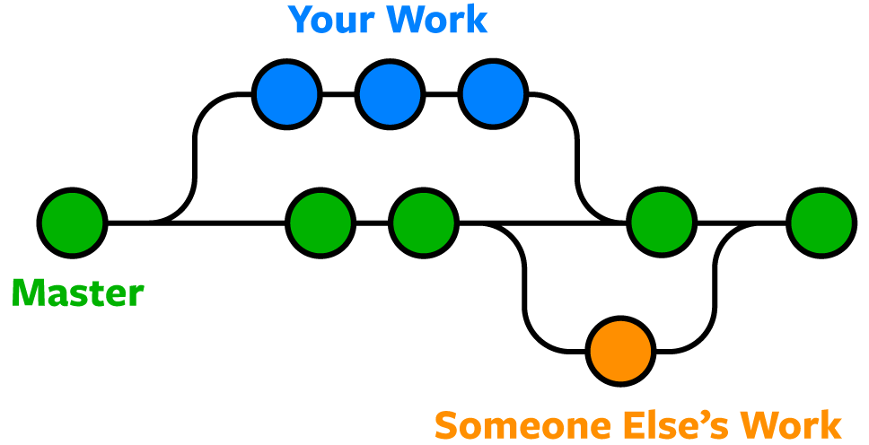
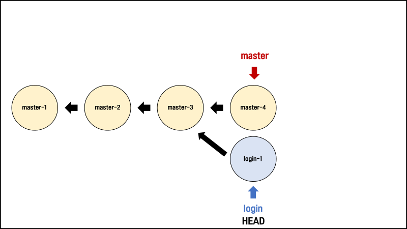

# Day13 0923

------

## [1] .gitignore

> 특정 파일 혹은 폴더에 대해 Git이 버전 관리를 하지 못하도록 지정하는 것

### (1) .gitignore에 작성하는 목록

- 민감한 개인 정보가 담긴 파일 (전화번호, 계좌번호, 각종 비밀번호, API KEY 등)
- OS(운영체제)에서 활용되는 파일
- IDE(통합 개발 환경 - pycharm) 혹은 Text editor(vscode) 등에서 활용되는 파일
  - 예) pycharm -> .idea/
- 개발 언어(python) 혹은 프레임워크(django)에서 사용되는 파일
  - 가상 환경 : `venv/`
  - `__pycache__/`

### (2) .gitignore 작성 시 주의 사항

- 반드시 이름을 `.gitignore`로 작성합니다. 앞의 점(.)은 숨김 파일이라는 뜻입니다.

- `.gitignore` 파일은 `.git` 폴더와 동일한 위치에 생성합니다.

- **제외 하고 싶은 파일은 반드시 `git add` 전에 `.gitignore`에 작성합니다.**

  ❗ **왜 git add 전에 .gitignore에 작성해야 할까요?**

  `git add a.txt` 라고 작성하면, 이제 Git은 `a.txt`를 버전 관리의 대상으로 여깁니다. 한 번 버전 관리의 대상이 된 `a.txt`는 이후에 .gitignore에 작성하더라도 무시되지 않고 계속 버전 관리의 대상으로 인식됩니다.

  따라서 제외 하고 싶은 파일은 반드시 git add 전에 .gitignore에 작성해야 합니다!

    

### (3) .gitignore 쉽게 작성하기

> .gitignore의 내용을 쉽게 작성할 수 있도록 도와주는 두 개의 사이트를 소개합니다. 자신의 개발 환경에 맞는 것을 찾아서 `전체 복사, 붙여넣기`를 하면 됩니다.

1. **웹사이트**

[gitignore.io](https://gitignore.io/)   

2. **gitignore 저장소**

https://github.com/github/gitignore


## [2] 심화

> .gitignore에 대해 조금 더 알아봅니다.

### (1) .gitignore 패턴 규칙

1. 아무것도 없는 라인이나, `#`로 시작하는 라인은 무시합니다.
2. `슬래시(/)`로 시작하면 하위 디렉터리에 재귀적으로 적용되지 않습니다.
3. 디렉터리는 `슬래시(/)`를 끝에 사용하는 것으로 표현합니다.
4. `느낌표(!)`로 시작하는 패턴의 파일은 ignore(무시)하지 않습니다.
5. 표준 Glob 패턴을 사용합니다.
   - `*(asterisk)`는 문자가 하나도 없거나 하나 이상을 의미합니다.
   - `[abc]`는 중괄호 안에 있는 문자 중 하나를 의미합니다.
   - `물음표(?)`는 문자 하나를 의미합니다.
   - `[0-9]`처럼 중괄호 안에 하이픈(-)이 있는 경우 0에서 9사이의 문자 중 하나를 의미합니다.
   - `**(2개의 asterisk)`는 디렉터리 내부의 디렉터리까지 지정할 수 있습니다. (`a/**/z`라고 작성하면 `a/z`, `a/b/z`, `a/b/c/z` 까지 모두 영향을 끼칩니다.)

### (2) 패턴 예시

```bash
# .gitignore

# 확장자가 txt인 파일 무시
*.txt

# 현재 확장자가 txt인 파일이 무시되지만, 느낌표를 사용하여 test.txt는 무시하지 않음
!test.txt

# 현재 디렉터리에 있는 TODO 파일은 무시하고, folder/TODO 처럼 하위 디렉터리에 있는 파일은 무시하지 않음
/TODO

# build/ 디렉터리에 있는 모든 파일은 무시
build/

# folder/notes.txt 파일은 무시하고 folder/child/arch.txt 파일은 무시하지 않음
folder/*.txt

# folder 디렉터리 아래의 모든 .pdf 파일을 무시
folder/**/*.pdf
```


------

## [1] 원격 저장소 가져오기

> 지금까지는 로컬 저장소의 내용을 원격 저장소에 업로드하는 것을 학습했습니다. 이번에는 반대로, 원격 저장소의 내용을 로컬 저장소로 가져오는 것을 학습합니다.

### (1) git clone

- 원격 저장소의 커밋 내역을 모두 가져와서, 로컬 저장소를 생성하는 명령어

- clone은 `"복제"`라는 뜻으로, `git clone` 명령어를 사용하면 원격 저장소를 통째로 복제해서 내 컴퓨터에 옮길 수 있습니다.

- `git clone <원격 저장소 주소>`의 형태로 작성합니다.

  ```bash
  $ git clone <https://github.com/edukyle/TIL.git>
  Cloning into 'TIL'...
  remote: Enumerating objects: 3, done.
  remote: Counting objects: 100% (3/3), done.
  remote: Total 3 (delta 0), reused 3 (delta 0), pack-reused 0
  Receiving objects: 100% (3/3), done.
  ```

  위에 작성한 대로 실행하면, `Github의 edukyle이라는 계정의 TIL 원격 저장소를 복제`하여 내 컴퓨터에 TIL이라는 이름의 로컬 저장소를 생성하게 됩니다.

- git clone을 통해 생성된 로컬 저장소는 `git init`과 `git remote add`가 이미 수행되어 있습니다.

### (2) git pull

- 원격 저장소의 변경 사항을 가져와서, 로컬 저장소를 업데이트하는 명령어

- 로컬 저장소와 원격 저장소의 내용이 완전 일치하면 git pull을 해도 변화가 일어나지 않습니다.

- `git pull <저장소 이름> <브랜치 이름>`의 형태로 작성합니다.

  ```bash
  $ git pull origin master
  From <https://github.com/edukyle/git-practice>
   * branch            master     -> FETCH_HEAD
  Updating 6570ecb..56809a9
  Fast-forward
   README.md | 1 +
   1 file changed, 1 insertion(+)
  
  [풀이]
  git 명령어를 사용할건데, origin이라는 원격 저장소의 master 브랜치의 내용을 가져온다(pull).
  ```

💡 **git clone vs git pull**

>clone과 pull이 모두 원격 저장소로부터 가져오는 명령어라서 조금 혼동될 수 있습니다.
>
>`git clone`은 git init처럼 처음에 한 번만 실행합니다. 즉 로컬 저장소를 만드는 역할이죠. 단, git init처럼 직접 로컬 저장소를 만드는 게 아니라, Github에서 저장소를 복제해서 내 컴퓨터에 똑같은 복제본을 만든다는 차이가 있습니다.
>
>`git pull`은 git push처럼 로컬 저장소와 원격 저장소의 내용을 동기화하고 싶다면 언제든 사용합니다. 단, push는 로컬 저장소의 변경 내용을 원격 저장소에 반영하는 것이고, pull은 원격 저장소의 변경 내용을 로컬 저장소에 반영하는 것입니다. **즉 방향이 다릅니다!**


## [2] 내 컴퓨터 ↔ Github(원격 저장소) ↔ 강의장 컴퓨터 (예시)

> 두 개 이상의 로컬 저장소에서 하나의 원격 저장소에 접근하면 어떻게 될까요? 집과 강의장을 오가면서 `clone, push, pull` 하는 과정을 살펴보겠습니다.

### (1) 규칙

- 수업 때는 두 개의 폴더를 `"내 컴퓨터"`와 `"강의장 컴퓨터"` 라고 가정합니다.
- 내 컴퓨터에 있는 로컬 저장소의 이름은 `TIL-home` 입니다.
- 강의장 컴퓨터에 있는 로컬 저장소의 이름은 `TIL-class` 입니다.
- Github에 있는 원격 저장소의 이름은 `TIL-remote` 입니다.

### (2) 사전 세팅

- 홈 디렉토리 안에 `TIL-home` 폴더를 생성합니다.

- Github에서 `TIL-remote` 라는 이름의 원격 저장소를 생성합니다.

- `TIL-home` 폴더에서 vscode를 엽니다.

- 아래와 같은 절차를 진행합니다.

  ```bash
  # TIL-home
  
  $ git init
  $ touch day1.md
  $ git add .
  $ git commit -m "집에서 Day1 작성"
  $ git remote add origin <https://github.com/edukyle/TIL-remote.git>
  $ git push origin master
  ```

  `TIL-home` 로컬 저장소의 내용이 `TIL-remote` 원격 저장소에 그대로 반영되었습니다.

- 결과

     

### (3) git clone

> 여러분은 이제 강의장에 왔습니다. 강의장 컴퓨터에는 여러분의 TIL 폴더가 없습니다.

- Github에 있는 `TIL-remote`에서 `git clone`을 통해 내려 받습니다.

  ```bash
  # TIL-class
  
  $ git clone <https://github.com/edukyle/TIL-remote.git> TIL-class
  ```

  **원격 저장소는 `TIL-remote` 이지만, 위와 같이 작성하면 강의장 컴퓨터에는 `TIL-class`라는 이름으로 로컬 저장소가 생성됩니다. (내부 파일 내용은 똑같습니다. 단지 폴더의 이름만 바뀝니다.)**

- 결과

     

### (4) git push

> 강의장 컴퓨터 → 원격 저장소

- 강의장에서 새로운 파일을 만들고 원격 저장소에 업로드 합니다.

  ```bash
  # TIL-class
  
  $ touch day2.md
  $ git add .
  $ git commit -m "강의장에서 Day2 작성"
  $ git push origin master
  ```

- 결과

  

### (5) git pull

> 원격 저장소 → 내 컴퓨터

- 내 컴퓨터에는 day2.md가 없습니다. 왜냐하면 강의장 컴퓨터에서 day2.md를 만들어서 원격 저장소에 push 했기 때문입니다. 따라서 원격 저장소에서 day2.md에 대한 내역을 가져와야 합니다.

  ```bash
  # TIL-home
  
  $ git pull origin master
  ```

- 결과

     

  이제 `내 컴퓨터, Github, 강의장 컴퓨터`의 내용은 동일합니다.

- **주의 사항 (글 만으로는 이해하기 어려우니, 직접 보여주면서 수업 합니다.)**

  ❗ 만약 TIL-home에서 pull이 아니라 commit을 먼저한 후 pull을 하면 어떻게 될까요? 다음 세 가지의 경우가 있을 수 있습니다.

  
  1. 내 컴퓨터와 강의장 컴퓨터에서 **서로 다른 파일을 수정**한 경우 → 정상적으로 git pull이 됩니다.
  2. 내 컴퓨터와 강의장 컴퓨터에서 **같은 파일을 수정했지만, 수정한 라인이 다른** 경우 → 정상적으로 git pull이 됩니다.
  3. 내 컴퓨터와 강의장 컴퓨터에서 **같은 파일의 같은 라인**을 수정한 경우 → **충돌(conflict)**이 발생합니다. 어느 내용을 반영할지 직접 선택해야 합니다.
  
  
  
   ❗ **만약 TIL-home에서 pull이 아니라 commit을 먼저한 후 바로 push 하면 어떻게 될까요?** **아래와 같은 에러 메시지가 나타나면서 push가 실패합니다.**
  
  > To https://github.com/edukyle/TIL-remote.git
  >
  > ! [rejected]     master -> master (non-fast-forward)
  >
  > error: failed to push some refs to 'https://github.com/edukyle/TIL-remote.git'
  >
  > 원격 저장소의 내용을 먼저 받아오지 않고, 로컬 저장소에서 새로운 커밋을 생성했기 때문에 서로의 커밋 내역이 달라져서 그렇습니다.
  >
  > 만약 로컬 저장소와 원격 저장소의 내용이 다르다면 일단 git pull을 통해 동기화를 시키고 새로운 커밋을 쌓아 나가야 합니다.
  
  

## [3] 실습

> 하나의 원격 저장소를 공유하며 끝말잇기를 진행합니다.

1. 조장은 홈 디렉토리에 `word-relay`라는 이름의 폴더를 생성합니다.

2. 조장은 Github에 `word-relay`라는 이름의 원격 저장소를 생성하고, 로컬 저장소와 연결합니다. (git remote add origin URL)

3. 조장은 로컬 저장소에 `README.md`파일을 생성하고 push 합니다.

4. 조장은 원격 저장소의 collaborator로 조원을 추가합니다.

      

5. 조원은 초대 메일을 확인하여 초대를 수락합니다.

6. 조원은 `word-relay` 원격 저장소를 clone 받습니다. (git clone URL)

7. 조장과 조원은 `add, commit, push, pull`을 이용해서 끝말잇기를 진행합니다.

<aside> 💡 **규칙**

1. 자신이 끝말잇기를 작성하고 push했다면, 상대방에게 push한 사실을 알립니다.
2. 끝말잇기는 README.md에 작성합니다.
3. 릴레이가 10회가 되기 전에 끝나거나, 10회가 되면 끝말잇기를 종료합니다.
4. `git pull → git add → git commit → git push` 순서를 꼭 지킵니다!

</aside> 

8. 예시

   


## [1] Branch

> Git에서 Branch라는 개념은 매우 중요합니다. 사실상 버전 관리의 꽃이라고 할 수 있습니다.

### (1) Branch란?

   

## Branch는 `나뭇가지`라는 뜻의 영어 단어입니다.

- 즉 `브랜치`란 나뭇가지처럼 여러 갈래로 작업 공간을 나누어 **독립적으로 작업**할 수 있도록 도와주는 Git의 도구입니다.
- 장점
  1. 브랜치는 독립 공간을 형성하기 때문에 원본(master)에 대해 안전합니다.
  2. 하나의 작업은 하나의 브랜치로 나누어 진행되므로 체계적인 개발이 가능합니다.
  3. 특히나 Git은 브랜치를 만드는 속도가 굉장히 빠르고, 용량도 적게 듭니다.
- 그래도 브랜치 꼭 써야하나요?
  1. 일단 master 브랜치는 상용을 의미합니다. 그래서 언제든 세상에 공개되어 있습니다.
  2. 만약 상용에 에러가 있어서 고쳐야 한다면 어떻게 해야할까요?
  3. 고객들이 사용하고 있는데, 함부로 버전을 되돌리거나 삭제할 수 있을까요?
  4. 따라서 브랜치를 통해 별도의 작업 공간을 만들고, 그곳에서 되돌리거나 삭제를 합니다.
  5. 브랜치는 완전하게 독립이 되어있어서 어떤 작업을 해도 master에는 영향을 끼치지 못하죠.
  6. 그리고 이후에 에러를 해결했다면? 그 내용을 master에 반영할 수도 있습니다!
  7. 이러한 이유 때문에 Git에서 브랜치는 정말 강력한 기능 중의 하나라고 할 수 있습니다.

### (2) git branch

> 브랜치 `조회, 생성, 삭제 등` 브랜치와 관련된 Git 명령어

```bash
# 브랜치 목록 확인
$ git branch

# 원격 저장소의 브랜치 목록 확인
$ git branch -r

# 새로운 브랜치 생성
$ git branch <브랜치 이름>

# 특정 커밋 기준으로 브랜치 생성
$ git branch <브랜치 이름> <커밋 ID>

# 특정 브랜치 삭제
$ git branch -d <브랜치 이름> # 병합된 브랜치만 삭제 가능
$ git branch -D <브랜치 이름> # (주의) 강제 삭제 (병합되지 않은 브랜치도 삭제 가능)
```

### (3) git switch

> 현재 브랜치에서 다른 브랜치로 `HEAD`를 이동시키는 명령어 `HEAD`란 현재 브랜치를 가리키는 포인터를 의미합니다.

```bash
# 다른 브랜치로 이동
$ git switch <다른 브랜치 이름>

# 브랜치를 새로 생성과 동시에 이동
$ git switch -c <브랜치 이름>

# 특정 커밋 기준으로 브랜치 생성과 동시에 이동
$ git switch -c <브랜치 이름> <커밋 ID>
```

❗ **git switch 하기 전에, 해당 브랜치의 변경 사항을 커밋 하셨나요?**

> master 브랜치와 feature 브랜치가 있다고 가정해보겠습니다. feature 브랜치에서 test.txt를 만들고 git commit 하지 않은 상황에서 master 브랜치로 이동하게 되면, test.txt 파일이 그대로 남아있습니다.
>
> 따라서 브랜치를 이동하기 전에, 꼭 커밋을 완료하고 이동하도록 합니다.


## [2] Branch scenario

> git branch와 git switch를 통해 브랜치를 `조회, 생성, 이동`하는 실습을 진행합니다.

### (1) 사전 세팅

1. 홈 디렉토리에 `git-branch-practice` 폴더를 생성하고 이동 후 vscode를 엽니다.

   ```bash
   $ mkdir git-branch-practice
   $ cd git-branch-practice
   $ code .
   ```

2. Git 저장소를 생성합니다.

   ```bash
   $ git init
   Initialized empty Git repository in C:/Users/kyle/git-branch-practice/.git/
   ```

3. `test.txt`를 생성하고 각각 `master-1, master-2, master-3` 이라는 내용을 순서대로 입력하여 커밋 3개를 작성합니다.

   ```bash
   $ touch test.txt
   
   test.txt에 master-1 작성
   $ git add .
   $ git commit -m "master-1"
   
   test.txt에 master-2 작성
   $ git add .
   $ git commit -m "master-2"
   
   test.txt에 master-3 작성
   $ git add .
   $ git commit -m "master-3"
   ```

4. `git log --oneline`을 입력했을 때 아래와 같이 나와야 정상입니다.

   총 3개의 버전이 master 브랜치에 만들어졌습니다.

   ```bash
   $ git log --oneline
   0604dcd (HEAD -> master) master-3
   9c22c89 master-2
   3d71510 master-1
   ```

5. 현재까지 결과

      

### (2) 브랜치 생성, 조회

1. 현재 위치(master 브랜치의 최신 커밋)에서 `login`이라는 이름으로 브랜치를 생성합니다.

   ```bash
   $ git branch login
   ```

2. login브랜치가 잘 생성되었는지 확인합니다.

   `* master`의 의미는 현재 HEAD가 가리키는 브랜치는 `master`라는 것입니다.

   ```bash
   $ git branch
   	login
   * master
   ```

3. `git log --oneline`을 입력했을 때 아래와 같이 나와야 정상입니다.

   `0604dcd` 커밋 기준으로 `master`와 `login`브랜치가 위치한 것을 볼 수 있습니다.

   ```bash
   $ git log --oneline
   0604dcd (HEAD -> master, login) master-3
   9c22c89 master-2
   3d71510 master-1
   ```

4. `master` 브랜치에서 1개의 커밋을 더 작성합니다.

   ```bash
   test.txt에 master-4 작성
   $ git add .
   $ git commit -m "master-4"
   ```

5. 현재까지 결과

      

### (3) 브랜치 이동

1. 현재 브랜치와 커밋의 상태는 다음과 같습니다.

   ```bash
   $ git log --oneline
   5ca7701 (HEAD -> master) master-4
   0604dcd (login) master-3
   9c22c89 master-2
   3d71510 master-1
   ```

2. 이때 `login`브랜치로 이동하면 어떤 일이 일어날까요?

   ```bash
   $ git switch login
   ```

   **master 브랜치의 test.txt에 작성한 master-4가 지워졌습니다!!**

   ```bash
   # login 브랜치의 test.txt
   
   master-1
   master-2
   master-3
   ```

3. 그리고 `git log --oneline`을 입력하면 아래와 같이 나타납니다.

   이제 `HEAD`는 `login` 브랜치를 가리키고, `master` 브랜치가 보이지 않습니다.

   ```bash
   $ git log --oneline
   0604dcd (HEAD -> login) master-3
   9c22c89 master-2
   3d71510 master-1
   ```

4. master 브랜치는 삭제된 걸까요?

   아닙니다! 브랜치를 조회 해보면 다음과 같이 나타납니다.

   HEAD가 `login` 브랜치를 가리키면서, log도 `login` 브랜치 기준으로 보이는 것이었습니다.

   ```bash
   $ git branch
   * login
     master
   ```

5. `git log --oneline --all`을 입력하면 모든 브랜치의 로그를 볼 수 있습니다.

   ```bash
   $ git log --oneline --all
   5ca7701 (master) master-4
   0604dcd (HEAD -> login) master-3
   9c22c89 master-2
   3d71510 master-1
   ```

6. 현재까지 결과

      

<aside> 💡 즉 브랜치를 이동한다는건 HEAD가 해당 브랜치를 가리킨다는 것을 의미하고 브랜치는 최신 커밋을 가리키므로, **HEAD가 해당 브랜치의 최신 커밋을 가리키게 됩니다.

따라서 워킹 디렉토리의 내용도 HEAD가 가리키는 브랜치의 최신 커밋 상태로 변화합니다.**

</aside>

### (4) login 브랜치에서 커밋 생성

1. `test.txt` 파일에 `login-1`이라고 작성합니다.

   ```bash
   # login 브랜치의 test.txt
   master-1
   master-2
   master-3
   login-1
   ```

2. 추가적으로 `test_login.txt`도 생성하고 `login-1`이라고 작성해봅시다.

   ```bash
   $ touch test_login.txt
   
   # 이후 test_login.txt에 작성
   login-1
   ```

3. 커밋을 생성합니다.

   ```bash
   $ git add .
   $ git commit -m "login-1"
   ```

4. `git log --oneline --all --graph`를 통해 아래와 같은 내용을 확인합니다.

   `master` 브랜치와 `login` 브랜치가 다른 갈래로 갈라진 것을 확인할 수 있습니다.

   ```bash
   $ git log --oneline --graph --all
   * 3b0a091 (HEAD -> login) login-1
   | * 5ca7701 (master) master-4
   |/
   * 0604dcd master-3
   * 9c22c89 master-2
   * 3d71510 master-1
   ```

5. 현재까지 결과

      


## [1] Branch Merge

> 지금까지는 브랜치를 통해서 독립된 작업 공간을 만드는 것 까지 진행했습니다. 이제 각 브랜치에서의 작업이 끝나면 어떻게 할까요? 그 작업 내용을 master에 반영해야 하지 않을까요? 지금부터는 `Merge`라고 하는 `병합`을 학습하면서 브랜치를 합치는 것을 살펴보겠습니다.

### (1) git merge

- 분기된 브랜치들을 하나로 합치는 명령어

- `git merge <합칠 브랜치 이름>`의 형태로 사용합니다.

- **Merge하기 전에 일단 다른 브랜치를 합치려고 하는, 즉 메인 브랜치로 switch 해야합니다.**

  ```bash
  # 1. 현재 branch1과 branch2가 있고, HEAD가 가리키는 곳은 branch1 입니다.
  $ git branch
  * branch1
    branch2
  
  # 2. branch2를 branch1에 합치려면?
  $ git merge branch2
  
  # 3. branch1을 branch2에 합치려면?
  $ git switch branch2
  $ git merge branch1
  ```

### (2) Merge의 세 종류

1. **Fast-Forward**

   - 브랜치를 병합할 때 마치 `빨리감기`처럼 브랜치가 가리키는 커밋을 앞으로 이동시키는 것

   1. 현재 master는 C2 커밋을, hotfix는 C4 커밋을 가리키고 있습니다.

         

   2. master에 hotfix를 병합하면 어떻게 될까요?

      ```bash
      $ git switch master
      $ git merge hotfix
      Updating s1d5f1s..1325sd4
      **Fast-forward**
       index.html | 2 ++
       1 file changed, 2 insertions(+)
      ```

   3. hotfix가 가리키는 C4는 C2에 기반한 커밋이므로, master가 C4에 이동하게 됩니다.

      이렇게 따로 merge 과정 없이 브랜치의 포인터가 이동하는 것을 `Fast-Forward`라고 합니다.

         

   4. 병합이 완료된 hotfix는 더 이상 필요 없으므로 삭제합니다.

      ```bash
      $ git branch -d hotfix
      Deleted branch hotfix (1325sd4).
      ```

2. **3-Way Merge**

   - 브랜치를 병합할 때 `각 브랜치의 커밋 두개와 공통 조상 하나`를 사용하여 병합하는 것
   - 두 브랜치에서 `다른 파일` 혹은 `같은 파일의 다른 부분`을 수정했을 때 가능합니다.

   1. 현재 master는 C4 커밋을, iss53은 C5 커밋을 가리키고 있습니다.

      master와 iss53의 공통 조상은 C2 커밋입니다.

         

   2. 이 상황에서 master에 iss53을 병합하면 어떻게 될까요?

      ```bash
      $ git switch master
      Switched to branch 'master'
      $ git merge iss53
      **Merge made by the 'ort' strategy.**
      index.html |    1 +
      1 file changed, 1 insertion(+)
      ```

   3. master와 iss53은 갈래가 나누어져 있기 때문에 Fast-Forward로 합쳐질 수 없습니다.

      따라서 공통 조상인 C2와 각자가 가리키는 커밋인 C4, C5를 비교하여 3-way merge를 진행합니다.

         

   4. 이때 생긴 C6는 master와 iss53이 병합되면서 발생한 Merge Commit입니다.

   5. 병합이 완료된 iss53은 더 이상 필요 없으므로 삭제합니다.

      ```bash
      $ git branch -d iss53
      Deleted branch iss53 (58sdf23).
      ```

3. **Merge Conflict**

   - 병합하는 두 브랜치에서 `같은 파일의 같은 부분`을 수정한 경우, Git이 어느 브랜치의 내용으로 작성해야 하는지 판단하지 못해서 발생하는 충돌(Conflict) 현상
   - 결국은 사용자가 직접 내용을 선택해서 Conflict를 해결해야 합니다.

   1. 현재 master는 C4 커밋을, iss53은 C5 커밋을 가리키고 있습니다.

      master와 iss53의 공통 조상은 C2 커밋입니다. `(3-way merge에서 상황과 같습니다)`

         

   2. 3-way merge와는 달리, 만약 master와 iss53이 `같은 파일의 같은 부분`을 수정하고 병합한다면 어떤 일이 발생할까요?

      ```bash
      $ git merge iss53
      Auto-merging index.html
      CONFLICT (content): Merge conflict in index.html
      Automatic merge failed; fix conflicts and then commit the result.
      ```

   3. 충돌이 일어난 파일을 확인하기 위해 `git status`를 입력합니다.

      ```bash
      $ git status
      On branch master
      You have unmerged paths.
        (fix conflicts and run "git commit")
      
      Unmerged paths:
        (use "git add <file>..." to mark resolution)
      
          both modified:      index.html
      
      no changes added to commit (use "git add" and/or "git commit -a")
      ```

   4. `index.html`을 열어보면 아래와 같이 충돌 내역이 나옵니다.

      ```html
      <<<<<<< HEAD:index.html
      <div id="footer">contact : email.support@github.com</div>
      =======
      <div id="footer">
       please contact us at support@github.com
      </div>
      >>>>>>> iss53:index.html
      ```

   5. `=======` 를 기준으로 위는 master의 내용, 아래는 iss53의 내용입니다.

      이 중 하나를 선택할 수도 있고, 둘 다 선택할 수도 있고, 아예 새롭게 작성할 수도 있습니다.

      ```html
      <div id="footer">
      please contact us at email.support@github.com
      </div>
      ```

   6. 이후 git add와 git commit을 통해 병합한 내용을 커밋할 수 있습니다.

      ```bash
      $ git add .
      $ git commit
      ```

   7. Vim 편집기를 이용해서 커밋 내역을 수정할 수 있습니다.

      ```bash
      Merge branch 'iss53'
      
      Conflicts:
          index.html
      #
      # It looks like you may be committing a merge.
      # If this is not correct, please remove the file
      #	.git/MERGE_HEAD
      # and try again.
      
      # Please enter the commit message for your changes. Lines starting
      # with '#' will be ignored, and an empty message aborts the commit.
      # On branch master
      # All conflicts fixed but you are still merging.
      #
      # Changes to be committed:
      #	modified:   index.html
      #
      ```

   8. Vim 편집기를 통해 작성한 커밋이 이제 C6 커밋이 됩니다.

         

   9. 병합이 완료된 iss53은 더 이상 필요 없으므로 삭제합니다.

      ```bash
      $ git branch -d iss53
      Deleted branch iss53 (58sdf23).
      ```

## [2] Branch-merge Scenario

> 지금까지 학습했던 git merge와 세 가지 상황에 대해 다시 한 번 살펴봅니다.

### (1) 사전 세팅

```bash
$ mkdir git_merge
$ cd git_merge

$ git init
$ touch test.txt

# test.txt 에 master test 1 을 입력 후 저장

$ git add .
$ git commit -m "master test 1"
```

### (2) Fast-Forward

   

💡 **login 브랜치가 생성된 이후 master 브랜치에 변경 사항이 없는 상황**


즉, master 브랜치에서 login 브랜치를 merge 할 때 login 브랜치가 master 브랜치 이후의 커밋을 가리키고 있으면 그저 master 브랜치가 login 브랜치와 동일한 커밋을 가리키도록 이동 시킬 뿐입니다.


1. `login` 브랜치 생성 및 이동합니다.

   ```bash
   $ git switch -c login
   ```

2. `login.txt`를 만들고 커밋합니다.

   ```bash
   $ touch login.txt
   $ git add .
   $ git commit -m "login test 1"
   ```

3. `master` 브랜치로 이동합니다.

   ```bash
   $ git switch master
   
   $ git log --oneline --all --graph
   * df231d0 (login) login test 1
   * 1e62b4c (HEAD -> master) master test 1
   ```

4. `master`에 `login`을 병합합니다.

   ```bash
   $ git merge login
   Updating 1e62b4c..df231d0
   **Fast-forward**
    login.txt | 0
    1 file changed, 0 insertions(+), 0 deletions(-)
    create mode 100644 login.txt
   ```

5. 결과를 확인합니다. (**Fast-forward**, 단순히 HEAD를 앞으로 빨리감기)

   ```bash
   $ git log --oneline --all --graph
   * df231d0 (HEAD -> master, login) login test 1
   * 1e62b4c master test 1
   ```

6. `login` 브랜치를 삭제합니다.

   ```bash
   $ git branch -d login
   Deleted branch login (was df231d0).
   
   $ git log --oneline --all --graph
   * df231d0 (HEAD -> master) login test 1
   * 1e62b4c master test 1
   ```

### (3) 3-way Merge (Merge commit)

   

<aside> 💡 현재 브랜치(master)가 가리키는 커밋이 Merge 할 브랜치의 조상이 아니면, git은 각 브랜치가 가리키는 커밋 2개와 공통 조상 하나를 사용하며 `3-way Merge` 합니다.

단순히 브랜치 포인터를 최신 커밋으로 옮기는 게 아니라 3-way Merge 의 결과를 별도의 커밋으로 만들고 나서 해당 브랜치가 그 커밋을 가리키도록 이동 시킵니다. 그래서 이런 커밋은 부모가 여러 개고 `Merge commit` 이라고 합니다.

</aside>

1. `signout` 브랜치를 생성 및 이동합니다.

   ```bash
   $ git switch -c signout
   ```

2. 특정 작업 완료 후 커밋합니다.

   ```bash
   $ touch signout.txt
   
   $ git add .
   $ git commit -m "signout test 1"
   
   $ git log --oneline
   bcade83 (HEAD -> signout) signout test 1
   df231d0 (master) login test 1
   1e62b4c master test 1
   ```

3. `master` 브랜치로 이동합니다.

   ```bash
   $ git switch master
   ```

4. `master`에 추가 작업 후 커밋합니다. (단 **`signout` 브랜치와 다른 파일**을 생성 혹은 수정합니다.)

   ```bash
   $ touch master.txt
   
   $ git add .
   $ git commit -m "master test 2"
   
   $ git log --all --oneline
   48bd5a6 (HEAD -> master) master test 2
   bcade83 (signout) signout test 1
   df231d0 login test 1
   1e62b4c master test 1
   ```

5. `master`에 `signout`을 병합합니다. (자동 merge commit 발생)

   ```bash
   $ git merge signout
   Merge made by the 'ort' strategy.
    signout.txt | 0
    1 file changed, 0 insertions(+), 0 deletions(-)
    create mode 100644 signout.txt
   ```

6. log 확인

   ```bash
   $ git log --oneline --all --graph
   *   ac0e971 (HEAD -> master) Merge branch 'signout'
   |\\
   | * bcade83 (signout) signout test 1
   * | 48bd5a6 master test 2
   |/
   * df231d0 login test 1
   * 1e62b4c master test 1
   ```

7. `signout` 브랜치 삭제

   ```bash
   $ git branch -d signout
   Deleted branch signout (was bcade83).
   ```

### (4) Merge Conflict

   

<aside> 💡 Merge 하는 두 브랜치에서 **같은 파일의 한 부분을 동시에 수정**하고 Merge 하면 Git은 해당 부분을 자동으로 Merge 하지 못하고 충돌이 일어납니다. **(반면 동일 파일이더라도 서로 다른 부분을 수정했다면, Conflict 없이 자동으로 Merge Commit 됩니다!)**

</aside>

1. `hotfix` 브랜치를 생성 및 이동합니다.

   ```bash
   $ git switch -c hotfix
   ```

2. 특정 작업 완료 후 커밋합니다.

   ```bash
   # test.txt 수정
   
   master test 1
   **이건 hotfix에서 작성한 문장입니다.**
   ```

   ```bash
   $ git add .
   $ git commit -m "hotfix test 1"
   
   $ git log --oneline --graph --all
   * ad045fa (HEAD -> hotfix) hotfix test 1
   *   ac0e971 (master) Merge branch 'signout'
   |\\
   | * bcade83 signout test 1
   * | 48bd5a6 master test 2
   |/
   * df231d0 login test 1
   * 1e62b4c master test 1
   ```

3. `master` 브랜치로 이동합니다.

   ```bash
   $ git switch master
   ```

4. 특정 작업(`hotfix` 와 동일 파일의 동일 부분 수정) 완료 후 커밋합니다.

   ```bash
   # text.txt 수정
   
   master test 1
   **이건 master에서 작성한 문장입니다.**
   ```

   ```bash
   $ git add .
   $ git commit -m "master test 3"
   
   $ git log --oneline --all --graph
   * 3170247 (HEAD -> master) master test 3
   | * ad045fa (hotfix) hotfix test 1
   |/
   *   ac0e971 Merge branch 'signout'
   |\\
   | * bcade83 signout test 1
   * | 48bd5a6 master test 2
   |/
   * df231d0 login test 1
   * 1e62b4c master test 1
   ```

5. `master`에 `hotfix`를 병합합니다.

   ```bash
   $ git merge hotfix
   ```

6. 결과 → merge conflict 발생 (**같은 파일의 같은 문장을 수정했기 때문입니다!**)

      

7. 충돌 확인 및 해결

   - Merge Conflict가 일어났을 때 Git이 어떤 파일을 Merge 할 수 없었는지 살펴보려면 `git status` 명령을 이용합니다.

   ```bash
   $ git status
   On branch master
   You have unmerged paths.
     (fix conflicts and run "git commit")
     (use "git merge --abort" to abort the merge)
   
   Unmerged paths:
     (use "git add <file>..." to mark resolution)
           both modified:   test.txt
   
   no changes added to commit (use "git add" and/or "git commit -a")
   ```

   ```
   master test 1
   <<<<<<< HEAD
   이건 master에서 작성한 문장입니다.
   =======
   이건 hotfix에서 작성한 문장입니다.
   >>>>>>> hotfix
   ```

   - `=======` 위쪽의 내용은 HEAD 버전(merge 명령을 실행할 때 작업하던 `master` 브랜치)의 내용이고 아래쪽은 `hotfix` 브랜치의 내용입니다. 충돌을 해결하려면 위쪽이나 아래쪽 내용 중에서 고르거나 새로 작성하여 Merge 해야 합니다. (`<<<<<<<, =======, >>>>>>>` 가 포함된 행은 삭제)

   ```bash
   # test.txt 최종본
   
   master test 1
   이건 충돌을 해결한 후의 문장입니다.
   ```

8. merge commit 진행합니다.

   ```bash
   $ git add .
   $ git commit
   ```

   - vim 편집기 등장

     ```bash
     Merge branch 'hotfix'
     
     # Conflicts:
     #       test.txt
     #
     # It looks like you may be committing a merge.
     # If this is not correct, please run
     #       git update-ref -d MERGE_HEAD
     # and try again.
     
     # Please enter the commit message for your changes. Lines starting
     # with '#' will be ignored, and an empty message aborts the commit.
     #
     # On branch master
     # All conflicts fixed but you are still merging.
     #
     ```

   - 작성된 커밋 메세지를 확인하고 `esc` 를 누른후 `:wq` 를 입력하여 저장 & 종료합니다.

     ```bash
     $ git commit
     [master 8ef1443] Merge branch 'hotfix'
     ```

9. log 확인

   ```bash
   $ git log --oneline --all --graph
   *   8ef1443 (HEAD -> master) Merge branch 'hotfix'
   |\\
   | * ad045fa (hotfix) hotfix test 1
   * | 3170247 master test 3
   |/
   *   ac0e971 Merge branch 'signout'
   |\\
   | * bcade83 signout test 1
   * | 48bd5a6 master test 2
   |/
   * df231d0 login test 1
   * 1e62b4c master test 1
   ```

10. `hotfix` 브랜치를 삭제합니다.


